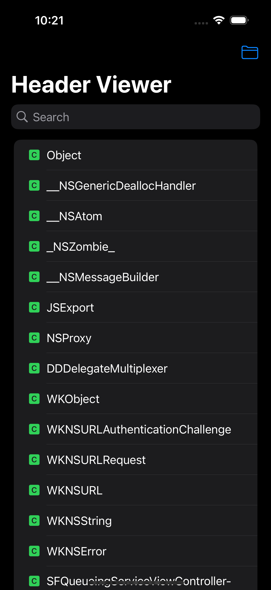
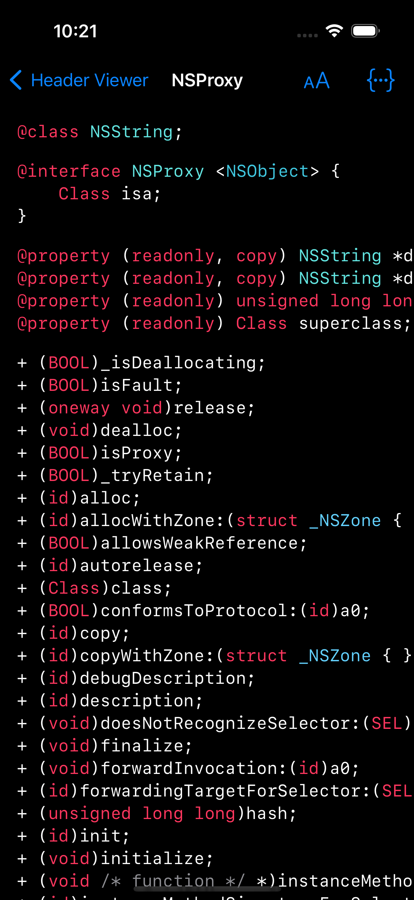
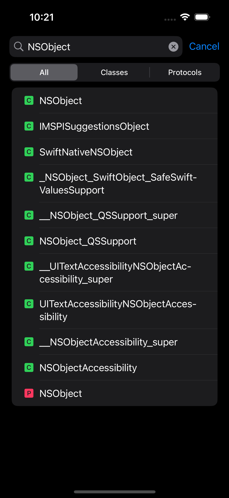
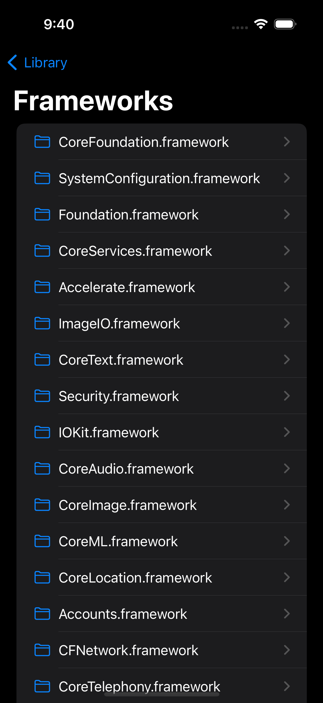
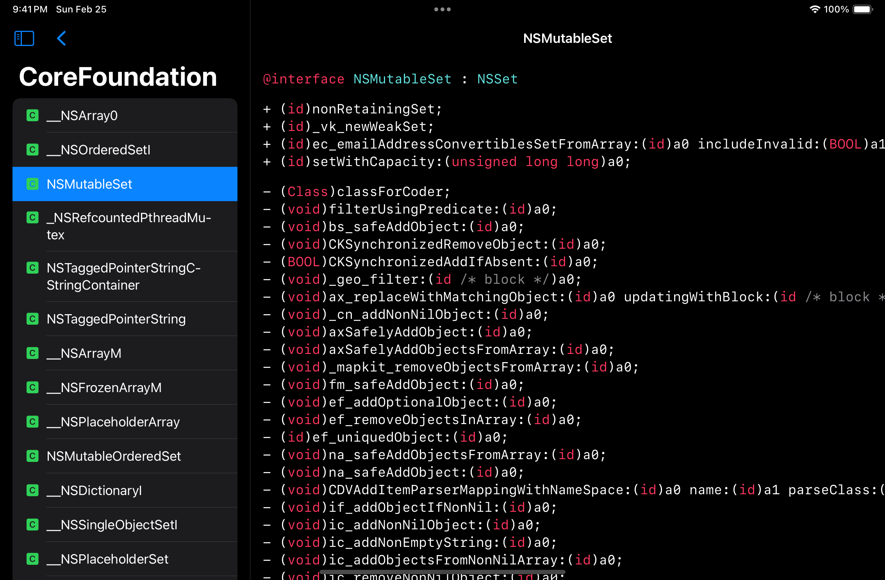

## HeaderViewer

HeaderViewer is an app for viewing Objective-C class and protocol headers generated by [ClassDumpRuntime](https://github.com/leptos-null/ClassDumpRuntime).

This project was inspired by https://github.com/nst/RuntimeBrowser

### Features

- List all loaded classes and protocols
- Filter class or protocol list by name
- Syntax-colored header files
- Navigate to class or protocol referenced in header
- Browse system images
    - Load image if not yet loaded
    - View classes in each image

### Screenshots

